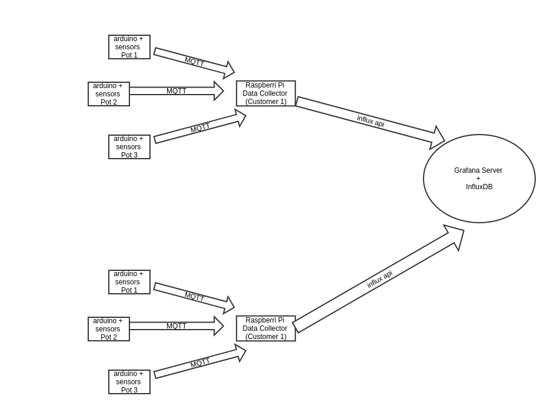

# Introduction

This is documentation for **Hortus** : *an intelligent horticulturist*. Below is an overview of the architecture of the system. 



## Configs 
This section has all the basic configs and communication topics


### Sample Configuration 

Here is a sample config for the setup of app running on local unit that communicates with remote db.

```json
{
"Layout":{
	"Subsection" : [
		{0 : "plant1"},
		{1 : "plant2"}
		]
	},
"Cirrus" :{
	"ip"     : "influxdb_ip",
	"user"   : "username",
	"passwd" : "passwd"
	},
"MQTT" :{
	"host" : "broker_uip",
   "port" :  "port",
   "ca_path" : "ca_path"
	} 
}
```
- *Layout* : Config parameters for plants in local site.
- *Cirrus* : Database credentials and config parameters. 
- *MQTT* : Mqtt broker parameters.
### Influx data format

Sample Influx db message body

```json
[
 {
	 "measurement": "sensor_name",
	 "tags": {
		 "home": "Section",
		 "direction": "Subsection",
		 "pot": "plant1_0"
	 },
	 "time": 1231234131,
	 "fields": {
		 "value": 123.00
	 }
 }
]

```

### MQTT topics
```sh
/Subsection/plant1/0/sensor_name
```

## Links
1. [TO-DOs](todos.md)
2. [Modules](pi_modules.md)
